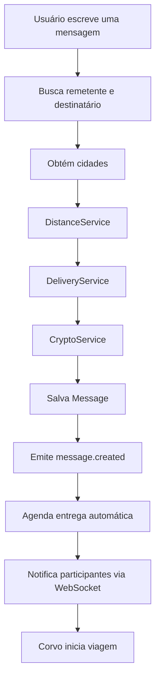
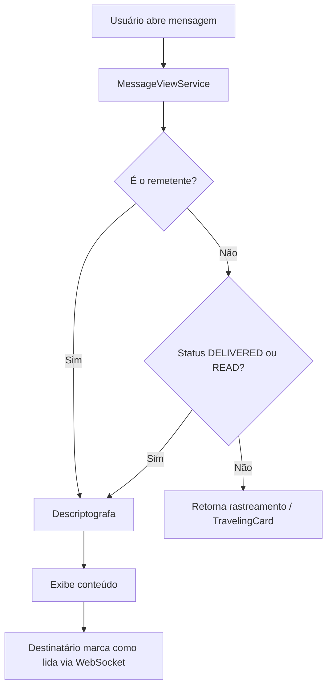
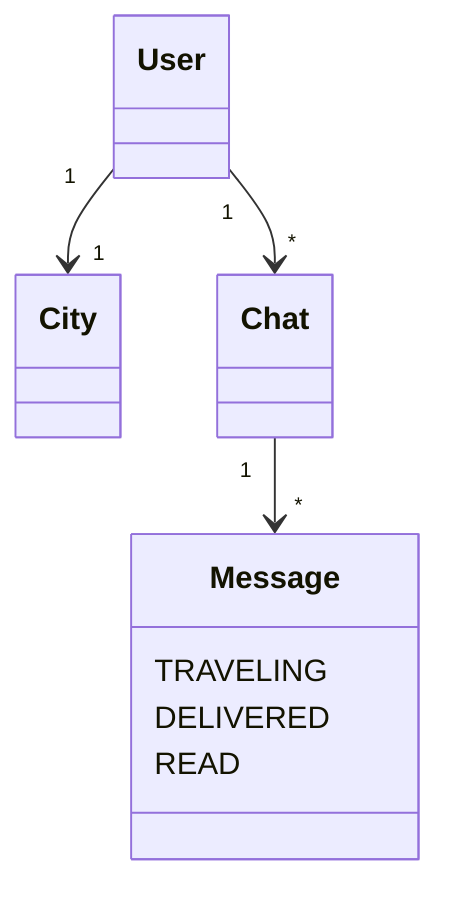
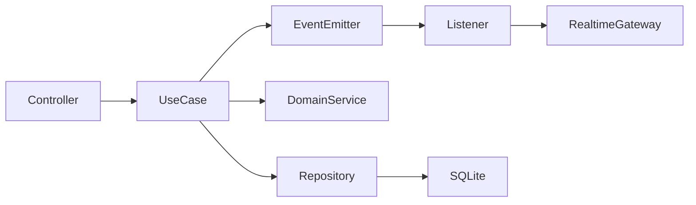

<p align="center">
  
</p>

# 🐦‍ Corvo-Zap

<p align="center">

**Porque algumas mensagens merecem fazer uma jornada.**

Envie sua mensagem através de um corvo.

As mensagens levam tempo para chegar ao destino, de acordo com a distância entre as cidades dos usuários.

</p>

---

## Sobre

O **Corvo-Zap** é um aplicativo de mensagens inspirado nos mensageiros medievais.

Diferente dos aplicativos tradicionais, uma mensagem não é entregue instantaneamente. Quando uma carta é enviada, um corvo inicia sua viagem entre duas cidades. Durante esse período, o remetente pode acompanhar a entrega, enquanto o destinatário precisa aguardar a chegada do corvo para ler o conteúdo.

O projeto foi criado como um laboratório para estudo de arquitetura de software, Domain-Driven Design (DDD), NestJS, React Native e boas práticas de engenharia de software.

---

<p align="center">


</p>

---

# Estrutura do projeto

```
corvo-zap/
├── backend/     # API NestJS (REST + WebSocket)
└── frontend/    # App mobile/web com Expo (React Native)
```

Documentação detalhada da API: [`backend/README.md`](./backend/README.md).

---

# Tecnologias

## Backend

* NestJS
* TypeScript
* TypeORM
* SQLite
* JWT Authentication
* bcryptjs
* Node Crypto (AES)
* Socket.IO (WebSocket)
* Event Emitter (eventos de domínio)
* Swagger
* Vitest

## Frontend

* Expo 57
* React Native
* Expo Router
* TypeScript
* TanStack Query
* Zustand
* Socket.IO Client

---

# Arquitetura

## Módulos do backend

```
src/modules/
├── auth              # Login e JWT
├── users             # Cadastro e listagem de usuários
├── profile           # Perfil do usuário autenticado
├── cities            # Cidades e coordenadas no mapa
├── chat              # Conversas entre dois usuários
├── messages          # Comandos de mensagem (envio, entrega, leitura)
├── messaging-query   # Consultas de mensagens e chats (leitura)
├── crypto            # Criptografia do conteúdo
├── password          # Hash de senhas
├── delivery          # Distância, tempo de viagem, rastreamento e agendamento
├── events            # Eventos de domínio (created, delivered, read)
└── realtime          # WebSocket e notificações em tempo real
```

Cada módulo possui uma única responsabilidade, seguindo princípios de Clean Architecture e SOLID. A separação entre `messages` (escrita) e `messaging-query` (leitura) organiza comandos e consultas de forma explícita.

## Camadas por módulo

```
application/usecases   → orquestração da regra de negócio
domain                 → entidades, contratos e tipos
infra                  → TypeORM, gateways e integrações
interfaces/http        → controllers REST e DTOs
shared/infra/http      → guards, decorators e filtros
```

---

# Como funciona



---

# Fluxo de leitura



---

# Tempo real

O app mantém uma conexão WebSocket (`/realtime`) autenticada com JWT.

| Evento | Direção | Descrição |
|---|---|---|
| `joinChat` | Cliente → Servidor | Entra na sala do chat |
| `markMessageRead` | Cliente → Servidor | Marca mensagem como lida |
| `message.created` | Servidor → Cliente | Nova mensagem enviada |
| `message.delivered` | Servidor → Cliente | Corvo chegou ao destino |
| `message.read` | Servidor → Cliente | Mensagem lida pelo destinatário |

Quando o WebSocket está ativo, o frontend deixa de fazer polling e atualiza chats e mensagens instantaneamente.

---

# Funcionalidades

## Usuários

* Cadastro
* Login
* JWT
* Associação com cidade
* Busca paginada por nome ou e-mail

## Perfil

* Consulta do perfil autenticado (`/profile/me`)
* Exibição da cidade do usuário

## Chats

* Criar chat
* Listar chats do usuário
* Buscar usuários para iniciar conversa

## Mensagens

* Enviar mensagens
* Conteúdo criptografado
* Status: `TRAVELING`, `DELIVERED`, `READ`
* Entrega automática agendada
* Confirmação de leitura
* Rastreamento em tempo real (WebSocket + progresso ao vivo)

## Cidades

* Listagem
* Cadastro e atualização (Admin)

## Distância e entrega

Calcula automaticamente:

* distância entre cidades
* tempo de viagem
* partida e chegada prevista
* progresso da viagem

## Rastreamento

Cada mensagem possui informações sobre sua viagem.

Exemplo:

```json
{
  "status": "TRAVELING",
  "progress": 67,
  "distanceKm": 1484,
  "remainingMinutes": 367,
  "arrivalAt": "2026-07-12T15:27:02Z",
  "deliveredAt": null,
  "readAt": null
}
```

No app mobile, mensagens em trânsito exibem o **TravelingCard** com barra de progresso, distância percorrida e tempo restante.

---

# Estrutura do domínio



A entrega e o rastreamento fazem parte do ciclo de vida da `Message`, orquestrados pelo módulo `delivery` e propagados via `events` + `realtime`.

---

# Exemplo de retorno

```json
{
  "id": "...",
  "chatId": "...",
  "senderId": "...",
  "senderName": "João",
  "canRead": true,
  "departureAt": "...",
  "originCityId": "...",
  "destinationCityId": "...",
  "travelTimeMinutes": 1113,
  "tracking": {
    "status": "DELIVERED",
    "progress": 100,
    "distanceKm": 1484,
    "remainingMinutes": 0,
    "arrivalAt": "...",
    "deliveredAt": "...",
    "readAt": null
  },
  "content": "Tudo certo e com você?"
}
```

---

# Como rodar

## Backend

```bash
cd backend
npm install

# .env
JWT_SECRET=sua-chave-secreta
PORT=3000

npm run start:dev
```

API: `http://localhost:3000`  
Swagger: `http://localhost:3000/api/docs`

## Frontend

```bash
cd frontend
npm install

# .env (copie de .env.example)
EXPO_PUBLIC_API_URL=http://localhost:3000

npm start
```

No emulador Android, use `http://10.0.2.2:3000`. Em dispositivo físico na mesma rede, use o IP da máquina.

---

# Roadmap

## Backend

* ✅ Cadastro de usuários
* ✅ Login JWT
* ✅ Perfil do usuário
* ✅ Cadastro de cidades
* ✅ Chats
* ✅ Mensagens
* ✅ Criptografia
* ✅ Cálculo de distância
* ✅ Agendamento da entrega
* ✅ Rastreamento da viagem
* ✅ Eventos de domínio
* ✅ WebSocket (tempo real)
* ✅ Confirmação de leitura
* ✅ Separação comando/consulta (`messages` / `messaging-query`)

### Próximos passos

* 🟡 Testes unitários (entidades de domínio)
* 🟡 Testes E2E (spec inicial)
* ⬜ Cobertura completa de use cases
* ⬜ Docker
* ⬜ Refresh Token
* ⬜ Rate Limiting
* ⬜ Cache

---

## Mobile

* ✅ Expo / React Native
* ✅ Login e cadastro
* ✅ Lista de chats
* ✅ Tela de conversa
* ✅ Busca de usuários
* ✅ Perfil
* ✅ Rastreamento do corvo (TravelingCard)
* ✅ Tempo real via WebSocket
* ⬜ Push Notifications

---

## Gameplay

* ⬜ Mapa medieval
* ⬜ Corvos personalizados
* ⬜ Corvos lendários
* ⬜ Sistema de amizades
* ⬜ Grupos
* ⬜ Rotas entre cidades
* ⬜ Clima afetando a viagem
* ⬜ Conquistas

---

# Exemplo de arquitetura



---

# Objetivo

Este projeto tem como principal objetivo estudar:

* Arquitetura em Camadas
* Clean Architecture
* DDD
* SOLID
* CQRS leve (comando vs consulta)
* Eventos de domínio
* NestJS
* TypeORM
* WebSockets
* Autenticação JWT
* Criptografia
* Testes automatizados
* React Native / Expo
* AWS

utilizando um domínio divertido e diferente dos tradicionais sistemas CRUD.
