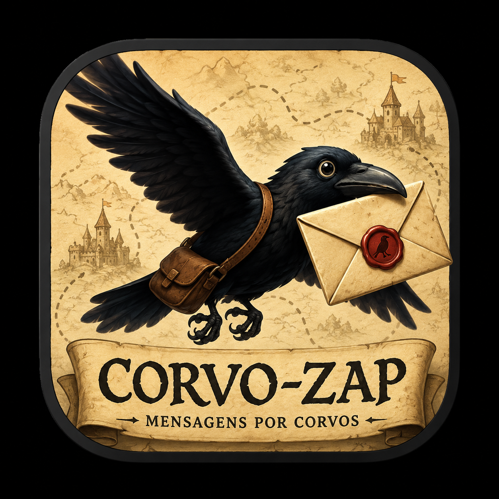
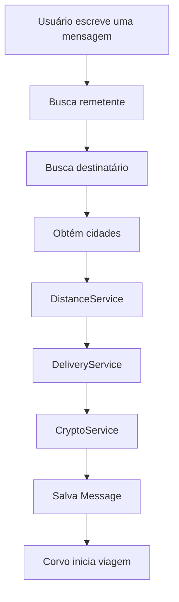
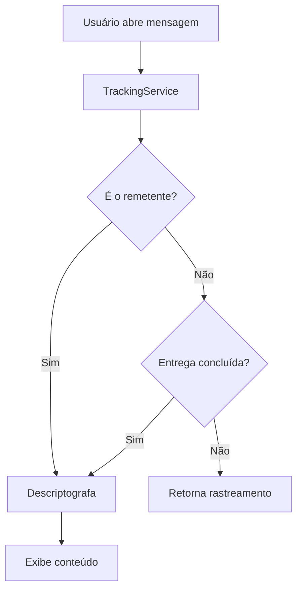
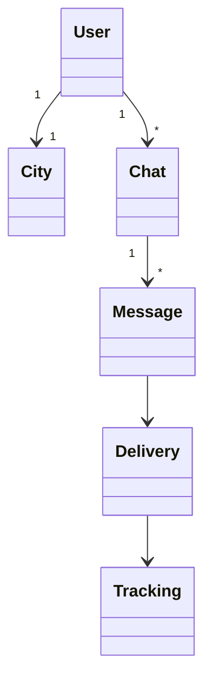
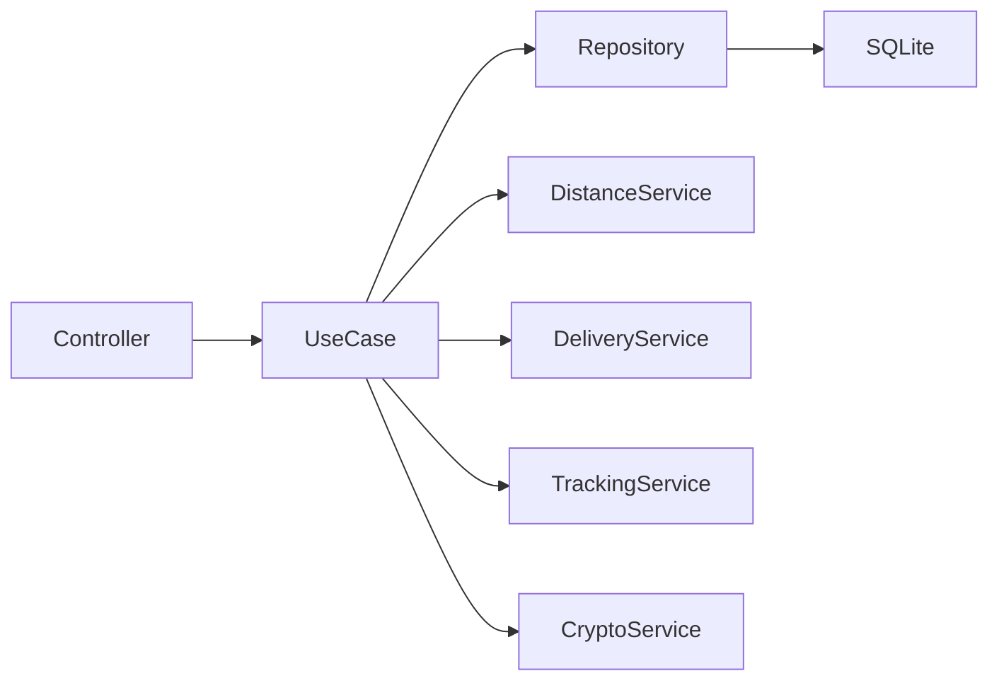

<p align="center">
  
</p>

# 🐦‍ Corvo-Zap

<p align="center">

**Porque algumas mensagens merecem fazer uma jornada.**

Envie sua mensagem através de um corvo.

As mensagens levam tempo para chegar ao destino, de acordo com a distância entre as cidades dos usuários.

</p>

---

## Sobre

O **Corvo-Zap** é um aplicativo de mensagens inspirado nos mensageiros medievais.

Diferente dos aplicativos tradicionais, uma mensagem não é entregue instantaneamente. Quando uma carta é enviada, um corvo inicia sua viagem entre duas cidades. Durante esse período, o remetente pode acompanhar a entrega, enquanto o destinatário precisa aguardar a chegada do corvo para ler o conteúdo.

O projeto foi criado como um laboratório para estudo de arquitetura de software, Domain-Driven Design (DDD), NestJS e boas práticas de engenharia de software.

---

<p align="center">


</p>

# Tecnologias

* NestJS
* TypeScript
* TypeORM
* SQLite
* JWT Authentication
* bcrypt
* Node Crypto (AES)
* Swagger

---

# Arquitetura

```
src
│
├── auth
├── users
├── cities
├── chats
├── messages
├── crypto
├── distance
├── delivery
└── tracking
```

Cada módulo possui uma única responsabilidade, seguindo princípios de Clean Architecture e SOLID.

---

# Como funciona



---

# Fluxo de leitura



---

# Funcionalidades

## Usuários

* Cadastro
* Login
* JWT
* Associação com cidade

---

## Chats

* Criar chat
* Listar chats do usuário

---

## Mensagens

* Enviar mensagens
* Conteúdo criptografado
* Rastreamento em tempo real

---

## Cidades

* Listagem
* Cadastro (Admin)

---

## Distância

Calcula automaticamente:

* distância
* tempo de viagem

---

## Entrega

Calcula automaticamente:

* partida
* chegada
* status

---

## Rastreamento

Cada mensagem possui informações sobre sua viagem.

Exemplo:

```json
{
  "status": "TRAVELING",
  "progress": 67,
  "distanceKm": 1484,
  "remainingMinutes": 367,
  "arrivalAt": "2026-07-12T15:27:02Z"
}
```

---

# Estrutura do domínio



---

# Exemplo de retorno

```json
{
  "id": "...",
  "chatId": "...",
  "senderId": "...",

  "departureAt": "...",

  "originCityId": "...",
  "destinationCityId": "...",

  "travelTimeMinutes": 1113,

  "tracking": {
    "status": "DELIVERED",
    "progress": 100,
    "distanceKm": 1484,
    "remainingMinutes": 0,
    "arrivalAt": "...",
    "deliveredAt": "..."
  },

  "content": "Tudo certo e com você?"
}
```

---

# Roadmap

## Backend

* ✅ Cadastro de usuários
* ✅ Login JWT
* ✅ Cadastro de cidades
* ✅ Chats
* ✅ Mensagens
* ✅ Criptografia
* ✅ Cálculo de distância
* ✅ Agendamento da entrega
* ✅ Rastreamento da viagem

### Próximos passos

* ⬜ Testes unitários
* ⬜ Testes E2E
* ⬜ Docker
* ⬜ Refresh Token
* ⬜ Rate Limiting
* ⬜ Cache

---

## Mobile

* ✅ React Native
* ✅ Login
* ✅ Lista de chats
* ✅ Tela de conversa
* ⬜ Rastreamento do corvo
* ⬜ Push Notifications

---

## Gameplay

* ⬜ Mapa medieval
* ⬜ Corvos personalizados
* ⬜ Corvos lendários
* ⬜ Sistema de amizades
* ⬜ Grupos
* ⬜ Rotas entre cidades
* ⬜ Clima afetando a viagem
* ⬜ Conquistas

---

# Exemplo de arquitetura



---

# Objetivo

Este projeto tem como principal objetivo estudar:

* Arquitetura em Camadas
* Clean Architecture
* DDD
* SOLID
* NestJS
* TypeORM
* Autenticação JWT
* Criptografia
* Testes automatizados
* React Native
* AWS

utilizando um domínio divertido e diferente dos tradicionais sistemas CRUD.
